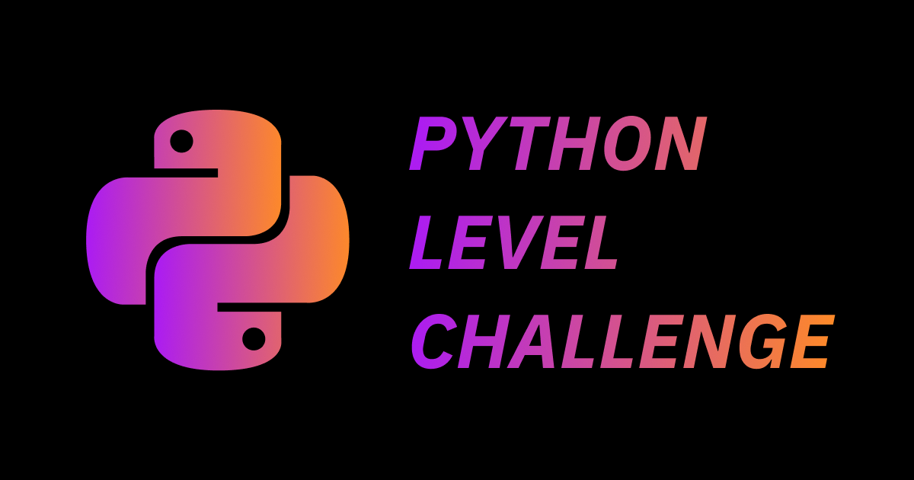

# Python Level Challenge


Go to Challenge 👉
[](https://plc.pengin7384.endpoint.ainize.ai/)

## 💯 A simple online python quiz
- Levels are provided based on result of quizzes
- Solve quizzes and check your level!

## ⌨️ How to use
- Open web browser(recommend `Chrome` browser)
- Connect `http://localhost:3000`(It's for local environment. other uses `http://<IP>:<PORT>` form)
- Click `Start a Quiz`
- Enjoy quizzes!
- You can see quiz result
- Share result with developer friends 

## 🚀 How to run

### On local(dev)
```
npm install -g nodemon
npm install
npm run watch
npm run dev
```
### On local(prod)
```
npm install
npm run build
npm run production
```

### Thru docker
```
docker build -t <Name> .
docker run -p 80:3000 -d <Name>
```

## 🛠 How to contribute
Feel free to post issues and pull requests. We need more programming language quizzes!

### Basic contribution Guidelines
Ensure your pull request adheres to the following guidelines.
- Leave issues if you have any interesting ideas or bugs.
- Use English in all cases(Communication, Comment, and Code review etc).

### Code contribution guide
- Indentation of 4 spaces.
- Name a react component file as pascal case, others snake case.
- Name a react component variable as pascal case, others camel case.
- Refer to existing codes.

### Quiz contribution guide
- Sync answers with questions.
- Questions and answers are added / modified / deleted according to the JSON format. See format below.
- Format
  - Question ([/src/static/json/python.json](https://github.com/ainize-team/python-level-challenge/blob/release/src/static/json/python.json))
    ```
    {
        "Id": (Integer, problem number in ascending order)[Required],
        "Subject": (String)[Required],
        "Difficulty": (Integer, 0:Easy 1:Normal 2:Hard)[Required],
        "Question": (String)[Required],
        "Code": (String)[Optional],
        "Answers": (Array of String)[Required],
        "Reference": (String)[Optional]
    }
    ```
  - Answer ([/src/static/json/python_answer.json](https://github.com/ainize-team/python-level-challenge/blob/release/src/static/json/python_answer.json))
    ```
    {
        "Id": (Integer, answer number in ascending order, must sync with question number)
        "Answer": (Integer, 0 ~ ...)
    }
    ```
